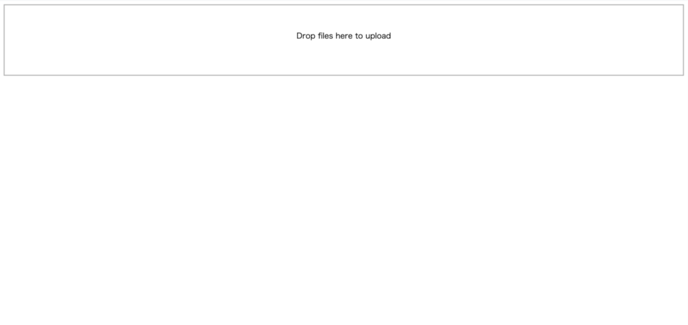
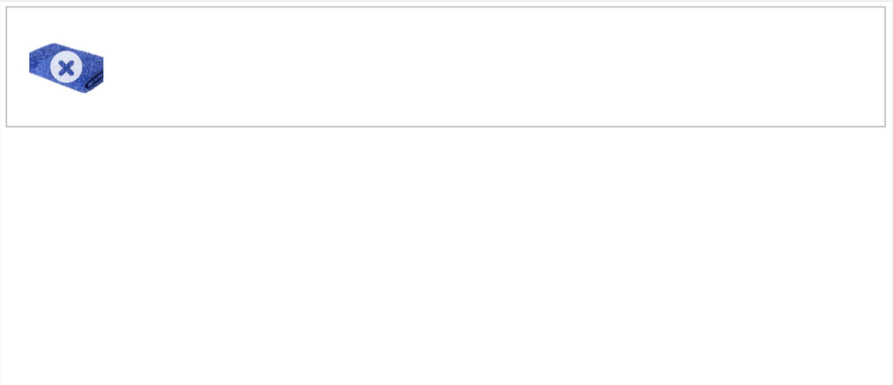

こんにちは。
みなさんハッピーアドベント！
楽しんでいらっしゃるでしょうか？？

冒険法人プラコレ新卒エンジニアの澤岻（タクシ）です。
我らがプラコレはアドベントカレンダー初参加です！
もちろん僕自身も初参加。
どうぞ、どうぞ、お手柔らかにお願いいたします！

今回はズバリ[dropzone.js](https://www.dropzonejs.com)について。

今年、とあるアプリケーションの開発の機会があり、
その際アップロード機能を作る必要があったのですが、
ボタンアップロードでは味気ないので、よく見かけるドラッグ&ドロップ式にすることにしました。
その際、導入も比較的しやすい　＋　UI UX的にも良さそうな[dropzone.js](https://www.dropzonejs.com)を使うことにしました。


# dropzone.jsとは
dropzone.jsは割と手軽にドラッグ&ドロップのアップロードフィールドを作れるライブラリです。
また、メソッドやイベントがいくつか用意されているので、カスタマイズも結構できます。
今回は導入の仕方から、いくつかオプション・イベントなどについてお話できたらと思います。

あくまでjavascriptのライブラリなので、
サーバー側の処理は独自に行う必要がありますが、
CSSもすでに用意されていて、特にデザイン指定がなければほぼコーディングの必要がないのでおすすめです。

【公式サイトはこちら】
https://www.dropzonejs.com/

#導入
導入はいたってシンプルです。

##dropzone.jsをダウンロード
まずは関連ファイルをダウンロードします。
下記リンク先ページから最新版がダウンロードできます。
※ダウンロードリンクは変わる可能性があるのでご了承ください。


https://github.com/enyo/dropzone/releases/latest


使用するのは
```
dropzone.js
basic.css
dropzone.css
```
の３つのファイルたちです。

##ファイルを読み込ませる
まずはファイルを読み込ませましょう。

```html
<head>
  <script src="js/dropzone.js" ></script>
  <link rel="stylesheet" href="css/basic.css" >
  <link rel="stylesheet" href="css/dropzone.css" />
</head>
```

dropzoneはデフォルトの動作として、
'dropzone'というクラスとform要素を探してアップロードフィールドを生成するようになっています。
なので、
```html
<form class="dropzone"></form>
```
とするとこのように表示されます。



これでザ・シンプルという感じですが、あっという間にドラッグ＆ドロップのフィールドができました！
ちなみにフィールドはドラッグ＆ドロップとクリックに対応しています。
そちらについては後ほど。
とにもかくにも実際に使ってみましょう。

##アップロードしてみる

実際にやってみるとこのように、アップロードしたファイルのサムネイルとともに、
アップロードが実行されます。



本当にアップロードをするにはサーバー側での処理が必要ですがこの段階ではまだできていないので、失敗という意味でバツ印が表示されています。
成功するとこれがチェックマークになります。
このようなUIが手軽に実装できるのも魅力の１つではないでしょうか。

ここまで、簡単ではありますが、導入方法を紹介させていただきました。
フレームワークなどを利用する場合でも、
基本的にはこのような方法で実装ができます。

##動的に生成する

先ほどのようにform要素と'dropzone'クラスでも生成することは可能なのですが、
それ以外にも動的に生成することも可能です。

その場合は、新たにインスタンス生成します。
また、細かく必要に応じてオプションを設定することも可能です。

```html
<div class="dropzone" id="myDropZone"></div>
```

とするならば、

javascript
```javascript
const myDropzone = new Dropzone('#myDropzone', {url: 'url/post'});
```

jQuery
```javascript
$("#myDropzone").dropzone({ url: 'url/post' });
```

とすれば動的にform要素以外でもフィールドを作ることができます。
url: 'url/post'
というのは、form要素以外で生成する際には必要です。
アップロードなどのPOSTの処理は、POST先のURLが必要になるので、
dropzone.jsでは、div要素なので作る場合、オプションにURLを指定してあげる必要があります。
でなければ、アップロードフィールドがきちんと生成されません。

この場合、javascriptは必ずフィールド要素の後に記述するようにしてください。
外のファイルを読み込ませる場合でも、headでの読み込みだと動作しないので注意が必要です。
その場合は、

```html
<div class="dropzone" id="myDropZone"></div>
<script src="js/main.js"></script>
```

のようにします。

#オプション・イベント

dropzoneにはオプションやイベントが用意されています。
結構あるので今回は僕が使ったオプションをピックアップしてご紹介します。
（全てのオプションは[こちらから](https://www.dropzonejs.com/#configuration)）
<br />

```
url
```
POST先のURLを指定します。
<br />

```
paramName
```
POSTの際のリクエストパラメータ名が設定できます。
<br />

```
uploadMultiple
```
複数のファイルアップロードの可否を設定できます。
デフォルトはfalseですが、trueに設定した場合、
paramNameで指定したパラメータ名には自動的に[]
が付与されます。
<br />

```
dictDefaultMessage
```
フィールド内に表示されるテキストを設定できます。
デフォルでは、　'Drop files here to upload'　です。
<br />

```
maxFilesize
```
ファイルサイズの最大値を設定できます。
デフォルトは256MBです。
<br />

```
autoProcessQueue
```
自動でプロセスキューに追加するかを設定します。
dropzone.jsはデフォルトだと、
ドロップした瞬間、ファイルアップロードが開始されます。
ですが今回は一度のアップロードに対してその時アップロードされたファイルが全てダウンロードできるURLとアクセス用パスワードが発行される設計にしたので、
１つでもドロップしてしまうと即座にURLが発行されてしまい不都合がありました。
そのため今回はこちらをfalseと設定することによって自動アップロードではなくボタンをクリックしてアップロードする形を取りました。
<br />

```
parallelUploads
```
並列処理されるファイルの数を設定します。
デフォルトは2です。
あまり大きく設定すると、
サーバー側での不可に繋がる可能性があるため、
サーバー規模などによって対応するといいと思います。
<br />

```
timeout
```
XHRリクエストのタイムアウトです。
ミリ秒で設定します。
デフォルトは30000です。
ネットワーク環境や何らかの事情で処理が遅い場合、途中で止まってしまう場合があるので、
サーバー設定などに合わせて伸ばしたりしても良さそうです。
<br />

このようなオプションを設定するには、
```javascript
var myDropzone = new Dropzone('#myDropzone', {
          url: '/post/file',
          paramName: 'file',
          dictDefaultMessage: 'ここにファイルをドラッグ＆ドロップしてください',
          maxFilesize: 1024,
          uploadMultiple: true,
          autoProcessQueue: false,
          parallelUploads: 5,
          timeout: 150000
  });
```
のように記述します。

また、dropzone.jsは様々なメソッド・イベントを組み合わせてカスタムすることもできます。（ここではjQueryを使用しています。）
例えば、
```
processQueue()
```
processQueueメソッドをこのように使うと、
<br />
```html
<button id="btn-upload">アップロードする</button>
```
```javascript
$('#btn-upload').click(function() {
    myDropzone.processQueue();
  });
```
クリックしたと同時にファイルをアップロードキューに追加するようにできます。
<br />

```
dragover dragleave
```
フィールドにドラッグ、そこから離れるときに使うイベントです。
枠線の色を変えたりするのに使いました。

```javascript
myDropzone.on("dragover", function(file) {
    $('.dropzone').css("border", "2px solid #009944");
    $('.dropzone').css("background-color", "#edf6d6");
  });
```

```javascript
myDropzone.on("dragleave", function(file) {
    $('.dropzone').css("border", "2px dashed #b6b6b6");
    $('.dropzone').css("background-color", "#fff");
  });
```
<br />

```
success
```
アップロードが完了のイベントです。
完了と同時にページ遷移したり、要素を追加したりするのに使いました。
今回は完了と同時にURL、パスワードを表示させるためのモーダルウィンドウを表示させるのに使いました。
```javascript
myDropzone.on("success", function(file) {
    setTimeout(function() {
      $('.modal-uploaded-after').addClass("is-view");
    }, 1500);
  });
```
<br />

イベントは他にももっと用意されているので自分なりに色々遊んでみるといいですね！
今回は少しだけしか紹介できませんが、個人的にももっと色々試してみたいと改めて思いました！


いかがでしたでしょうか？？
つたない文章でしたが少しでも皆さんのお役に立てることを願います！

#最後に
明日はプラコレが誇るエンジニア、
沈黙の救世主ことおっすん（井出さん）です！
LINE APIについて熱く語ってくれること間違いなし。
楽しみです！！！！

プラコレではDynamoDBを触りたいエンジニアも！もっと違うことをやりたいエンジニアも！デザイナーも！[募集](https://pla-cole.co/)しています！！

プラコレは[プラコレWedding](https://pla-cole.wedding/)以外にもウェディングのメディア[Dressy](https://dressy.pla-cole.wedding/)や[farny](https://www.farny.jp/)なども運営しています。ぜひ見ていってもらえると嬉しいです！

