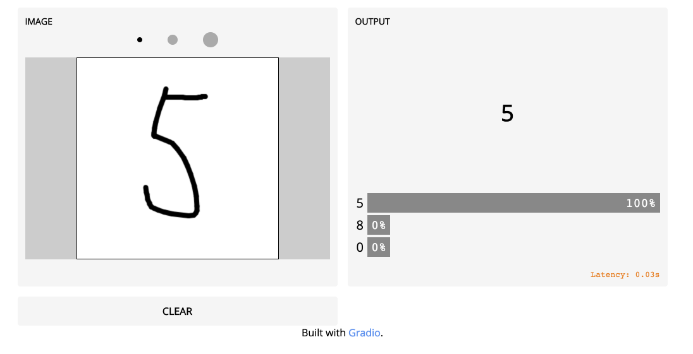

今回はこちらの記事の内容そっくりそのままやってみました。
19行のpythonコードでできちゃうという魅力的な内容となっています。


https://medium.com/swlh/a-gui-to-recognize-handwritten-digits-in-19-lines-of-python-fda715e525d0  

今回はとりあえずやってみたシリーズです！
なので、詳しい説明は省いていますのでご了承ください。
結構簡単にできるので、
python初心者、機械学習初心者、興味がある方、とりあえず何かやってみた方、などなど
ぜひ試してみてください！


## Step 1: 必要なものをインストール

Tensorflowをインストール  
https://www.tensorflow.org/
```bash
$ pip install tensorflow
```

Gradioをインストール  
https://www.gradio.app/
```bash
$ pip install gradio
```  
　
## Step 2: コードを書く
まず初めはmnistデータセットを読み込ませます。
mnistデータセットは手書き数字のデータベースです。
60,000のトレーニング用データと10,000のテスト用データが含まれています。  
http://yann.lecun.com/exdb/mnist/

https://www.tensorflow.org/datasets/catalog/mnist  

```python
import tensorflow as tf
import gradio as gr
(x_train, y_train), (x_test, y_test) = tf.keras.datasets.mnist.load_data()
x_train = x_train / 255.0, 
x_test = x_test / 255.0
```
ここにある、x_train = x_train / 255.0　などの記述は、
機械学習で画像を扱う場合定番の前処理で、「正規化」と呼ばれるものです。
だいたい挟まれる処理なので、こんなもんだと今回は思っておけば大丈夫です。
詳しく知りたい場合は、以下の記事がおすすめです！
https://potesara-tips.com/deeplearnig-preprocessing-image/

そして、モデルを訓練させます。
```python
model = tf.keras.models.Sequential([
  tf.keras.layers.Flatten(input_shape=(28, 28)),
  tf.keras.layers.Dense(128,activation='relu'),
  tf.keras.layers.Dense(10, activation='softmax')
])
model.compile(optimizer='adam', loss='sparse_categorical_crossentropy', metrics=['accuracy'])
model.fit(x_train, y_train, validation_data=(x_test, y_test), epochs=6)
```
これを実行すると、次のような出力が得られます。
```bash
Epoch 1/6
1875/1875 [==============================] - 3s 2ms/step - loss: 0.2574 - accuracy: 0.9273 - val_loss: 0.1361 - val_accuracy: 0.9588
Epoch 2/6
1875/1875 [==============================] - 3s 2ms/step - loss: 0.1143 - accuracy: 0.9659 - val_loss: 0.1036 - val_accuracy: 0.9684
Epoch 3/6
1875/1875 [==============================] - 3s 2ms/step - loss: 0.0802 - accuracy: 0.9755 - val_loss: 0.0895 - val_accuracy: 0.9723
Epoch 4/6
1875/1875 [==============================] - 3s 2ms/step - loss: 0.0587 - accuracy: 0.9824 - val_loss: 0.0784 - val_accuracy: 0.9771
Epoch 5/6
1875/1875 [==============================] - 3s 2ms/step - loss: 0.0453 - accuracy: 0.9861 - val_loss: 0.0707 - val_accuracy: 0.9787
Epoch 6/6
1875/1875 [==============================] - 3s 2ms/step - loss: 0.0351 - accuracy: 0.9890 - val_loss: 0.0709 - val_accuracy: 0.9776
```

次はGUIを作っていきます。

```python
def classify(image):
    prediction = model.predict(image).tolist()[0]
    return {str(i): prediction[i] for i in range(10)}
sketchpad = gr.inputs.Sketchpad()
label = gr.outputs.Label(num_top_classes=3)
interface = gr.Interface(classify, sketchpad, label, live=True, capture_session=True)

interface.launch()
```

これを以下のように実行
```bash
$ python3 handwriting_tutorial.py
```

```bash
Running locally at: http://127.0.0.1:7860/
```
と出力されるので7860ポートでアクセス。
でた！
簡単に手書き認識ができるようになりました！



今回はやってみたシリーズなので、ただただチュートリアルにしたがって試しただけですが、
出てきた用語や、コードなどは機械学習においてはとても重要なものが多いので、
興味のある方はじっくり調べてみるのをお勧めします！
特にTensorflowには様々なライブラリやサブモジュールなどが用意されていますし、
google colab　などを利用すればすぐに試すことができます。
ちょっとでも興味がある方はまず簡単なモデルを使って遊んでみるのがいいですね！
また何か面白いものがあれば試して紹介したいと思います！

Happy Hacking!
